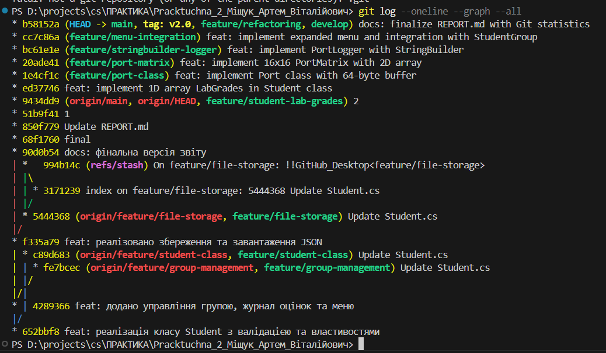

## 1. Відповіді на контрольні запитання

### 1.1. Різниця між одновимірними та двовимірними масивами
*   **Одновимірні масиви:** Це лінійна структура даних, де доступ до елементів здійснюється за одним індексом. У роботі вони використані для зберігання списку оцінок студента (`byte[] LabGrades`).
*   **Двовимірні масиви:** Це таблична структура (матриця), де доступ здійснюється за двома індексами (рядок та стовпець). У роботі вони використані для симуляції матриці портів 16×16 (`Port[,] _matrix`).

### 1.2. Ефективність StringBuilder
`StringBuilder` ефективніший за звичайну конкатенацію (`+`), оскільки він не створює новий об'єкт рядка при кожній зміні. Звичайні рядки в C# є *immutable* (незмінними). У класі `PortLogger` ми накопичуємо багато записів, і використання `StringBuilder` дозволяє уникнути надмірного виділення пам'яті та копіювання даних.

### 1.3. Реалізація симуляції портів
Симуляція реалізована через клас `Port`, який має буфер даних (`byte[] DataBuffer`) розміром 64 байти. Матриця портів (`PortMatrix`) керує двовимірним масивом об'єктів `Port`. Ми використовували масиви для фіксованого розміру буфера та структурованого доступу до "обладнання".

### 1.4. Інтеграція масивів в існуючу систему
Масиви були інтегровані в клас `Student` (додано поле `LabGrades`) та `StudentGroup` (методи зв'язку студента з портом). Це дозволило розширити функціонал ПР №1, додавши можливість відстежувати лабораторні роботи та робочі місця.

### 1.5. Логіка роботи з матрицею 16×16
Матриця ініціалізується двома циклами `for`. Кожен елемент `[r, c]` — це окремий об'єкт `Port` з унікальним ім'ям пристрою. Доступ до порту здійснюється за координатами, що імітує фізичну адресу пристрою.

### 1.6. Труднощі та рішення
*   **Труднощі:** Вихід за межі масиву при роботі з індексами матриці.
*   **Рішення:** Додано метод `CheckBounds`, який викидає `IndexOutOfRangeException` з детальним описом помилки.

### 1.7. Порівняння масивів з List<T>
`List<T>` зручніший для динамічних списків, де кількість елементів часто змінюється (як список студентів у групі). Масиви були обрані свідомо для:
1.  **LabGrades (1D):** Фіксована кількість лабораторних робіт (10).
2.  **PortMatrix (2D):** Статична структура обладнання (16x16), де важлива швидкість доступу за індексом.

### 1.8. Що нового ви дізналися?
Опановано роботу з двовимірними масивами, глибоке використання `StringBuilder` для генерації великих звітів, реалізацію інтерфейсу `ICloneable` та обробку власних винятків.

## 2. Git Статистика

*   **Кількість створених гілок:** 9 (`main`, `develop`, `feature/student-lab-grades`, `feature/port-class`, `feature/port-matrix`, `feature/stringbuilder-logger`, `feature/menu-integration`, `feature/persistence`, `feature/refactoring`)

**Посилання на репозиторій:** [GitHub Link Placeholder]

